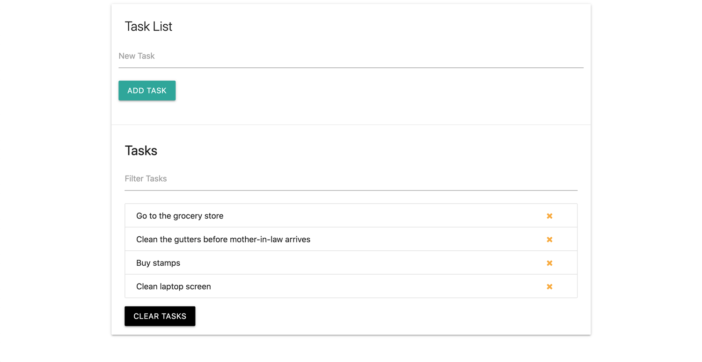

# _Task List_

#### This project is a browser-based task list application (aka a to-do list) that incorporates javascript DOM manipulation and also local browser storage to persist the data.

#### _06/2021_

#### By _**Chris Korsak**_

## Description

This task list application is a project from [Modern Javascript From The Beginning](https://www.udemy.com/course/modern-javascript-from-the-beginning) on Udemy. It notably uses javascript DOM manipulation and local browser storage to persist the data without needing a database.

Additionally, this application uses a CSS framework called [Materialize](https://materializecss.com/) to create the user interface. This application is fully responsive to all screen sizes.

### Features
* Add a new task. The application does not allow a blank input.
* Delete a task.
* Clear all tasks.
* Task list data is saved to local storage for persistant data on the user device.

## Setup/Installation Requirements

None. This is a web-based application hosted on Github pages. Check out the app [here!](https://chriskorsak.github.io/tasklist/)

## Technologies Used

* HTML
* CSS (Materialize framework)
* Javascript (including local storage)
  
